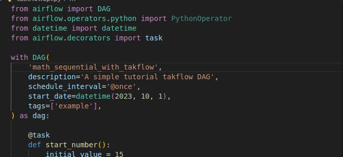

First DAG with Apache Airflow : 
#### https://github.com/Herman-Motcheyo/First-DAG-with-Apache-Airflow?tab=readme-ov-file

#### Linkdlin : https://www.linkedin.com/posts/herman-tcheneghon-motcheyo-8b95a7180_30daysofmlopscode-airflow-mlops-activity-7319661128886718464-NPYl?utm_source=share&utm_medium=member_desktop&rcm=ACoAACrNWk0BT9T4VwM8q0w_jQdvWAle2tcG53A
========

Welcome to Astronomer! This project was generated after you ran 'astro dev init' using the Astronomer CLI. This readme describes the contents of the project, as well as how to run Apache Airflow on your local machine.

Project Contents
================

This project demonstrates the fundamentals of building and orchestrating machine learning pipelines using **Apache Airflow**. Below are the descriptions of each script included in the repository:

---

### 1. `first_dag.py`  
A simulated end-to-end machine learning pipeline with the following stages:
- **Data Ingestion**
- **Data Preprocessing**
- **Model Training**
- **Model Evaluation**
- **Model Deployment**

Each stage is implemented as a `PythonOperator` task in Airflow and executed in sequence. This DAG simulates a typical production workflow in MLOps.

Source code : https://github.com/Herman-Motcheyo/First-DAG-with-Apache-Airflow/blob/main/dags/first_dag.py

---

### 2. `xcom_learning_dag.py`  
A simple Airflow DAG that demonstrates the use of **XComs (Cross Communication)** between tasks. The DAG performs the following steps:
- Initializes a number (`15`)
- Adds `11`
- Multiplies the result by `2`
- Subtracts `5` from the final result

This file is meant for learning how to pass data between tasks using Airflow’s `xcom_push` and `xcom_pull`.

Source code : https://github.com/Herman-Motcheyo/First-DAG-with-Apache-Airflow/blob/main/dags/xcom_learning.py
---

### 3. `taskflowapi.py`  
An enhanced version of the ML pipeline that uses **Airflow's TaskFlow API** to define tasks using Python decorators. It includes:
- A cleaner, more Pythonic structure with the `@task` decorator
- Basic model evaluation logic

Source code : https://github.com/Herman-Motcheyo/First-DAG-with-Apache-Airflow/blob/main/dags/taskflowapi.py
---

Deploy Your Project Locally
===========================

1. Start Airflow on your local machine by running 'astro dev start'.

This command will spin up 4 Docker containers on your machine, each for a different Airflow component:

- Postgres: Airflow's Metadata Database
- Webserver: The Airflow component responsible for rendering the Airflow UI
- Scheduler: The Airflow component responsible for monitoring and triggering tasks
- Triggerer: The Airflow component responsible for triggering deferred tasks

2. Verify that all 4 Docker containers were created by running 'docker ps'.

Note: Running 'astro dev start' will start your project with the Airflow Webserver exposed at port 8080 and Postgres exposed at port 5432. If you already have either of those ports allocated, you can either [stop your existing Docker containers or change the port](https://www.astronomer.io/docs/astro/cli/troubleshoot-locally#ports-are-not-available-for-my-local-airflow-webserver).

3. Access the Airflow UI for your local Airflow project. To do so, go to http://localhost:8080/ and log in with 'admin' for both your Username and Password.

You should also be able to access your Postgres Database at 'localhost:5432/postgres'.

Deploy Your Project to Astronomer
=================================

If you have an Astronomer account, pushing code to a Deployment on Astronomer is simple. For deploying instructions, refer to Astronomer documentation: https://www.astronomer.io/docs/astro/deploy-code/

Contact
=======

The Astronomer CLI is maintained with love by the Astronomer team. To report a bug or suggest a change, reach out to our support.
