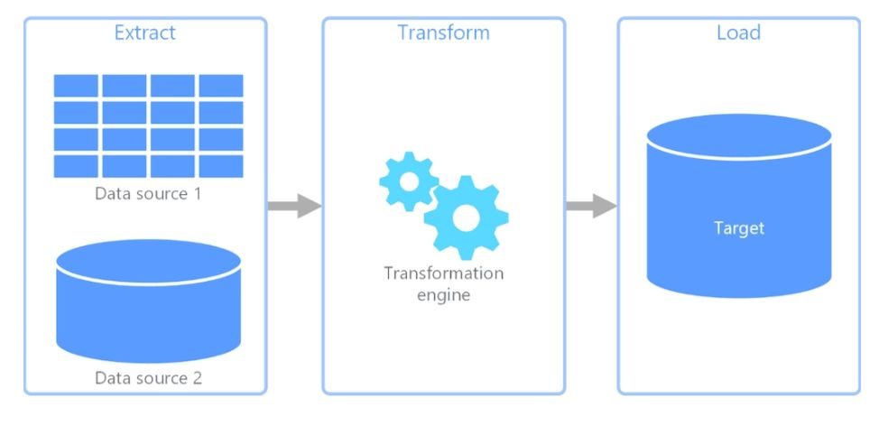

# ETL Pipeline

https://www.linkedin.com/posts/herman-tcheneghon-motcheyo-8b95a7180_30daysofmlopscode-mlops-etl-activity-7319797007731077121-SON2?utm_source=share&utm_medium=member_desktop&rcm=ACoAACrNWk0BT9T4VwM8q0w_jQdvWAle2tcG53A

Article : https://estuary.dev/blog/what-is-an-etl-pipeline/

