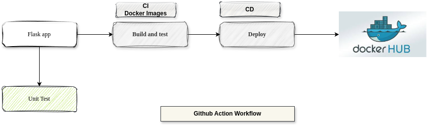
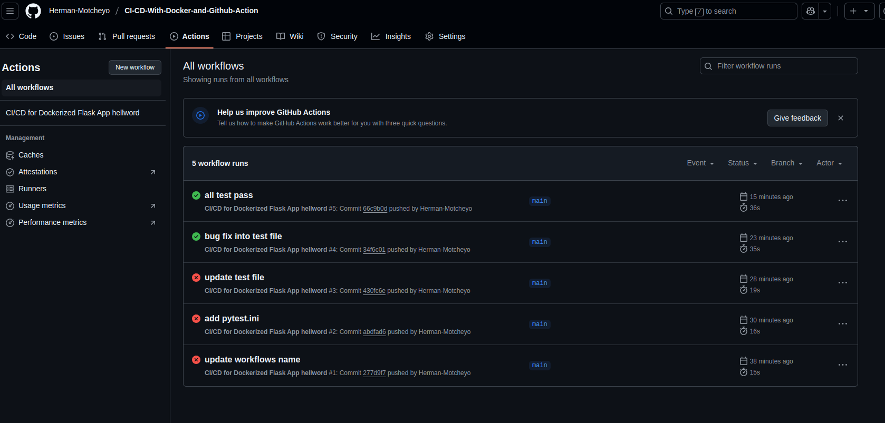
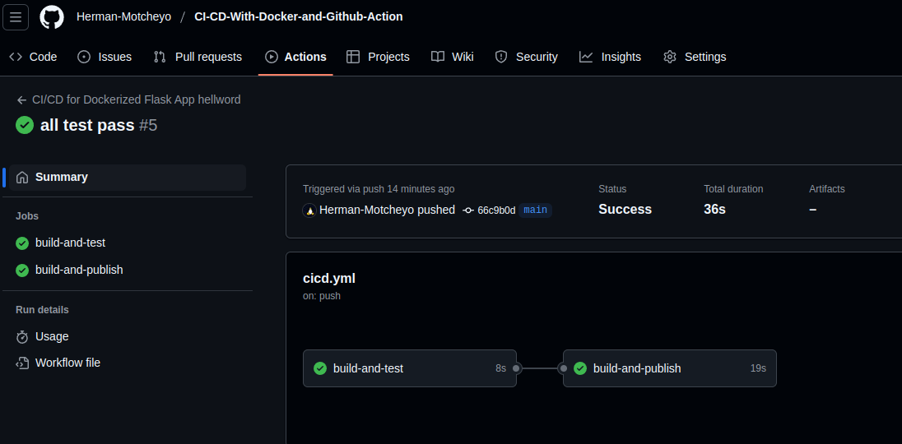
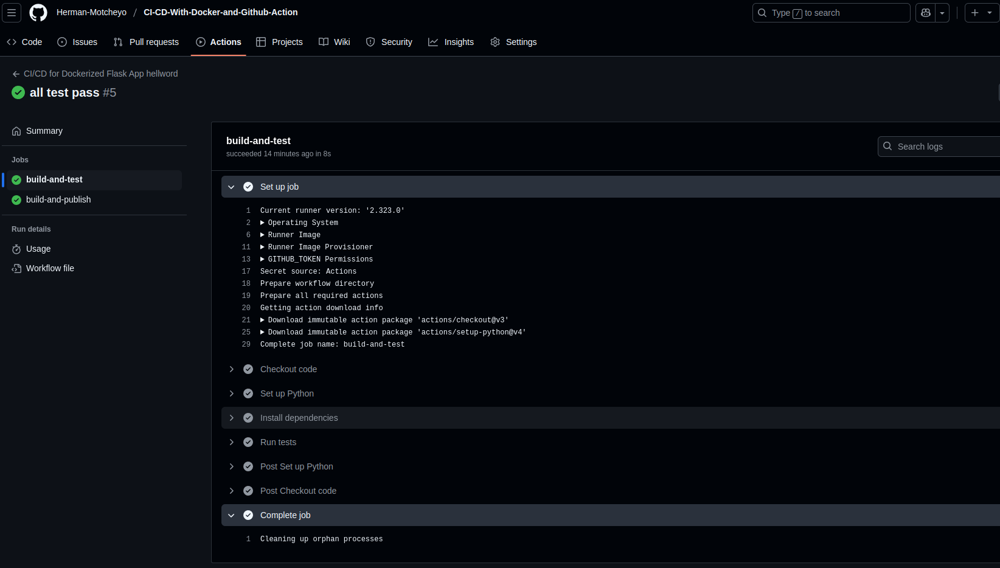
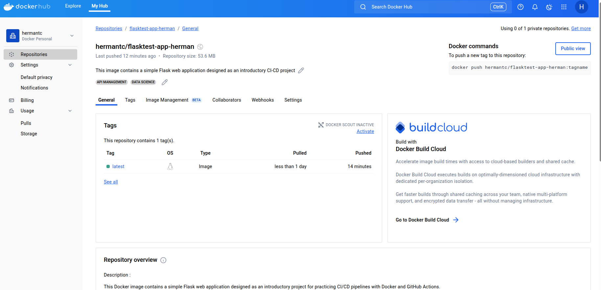

# My First CI/CD Project with Docker and GitHub Actions

Welcome to my first project designed to practice Continuous Integration and Continuous Deployment (CI/CD) using **Docker** and **GitHub Actions**!

https://www.linkedin.com/posts/herman-tcheneghon-motcheyo-8b95a7180_30daysofmlopscode-mlops-30daysofmlops-activity-7322853626245185537-YCjK?utm_source=share&utm_medium=member_desktop&rcm=ACoAACrNWk0BT9T4VwM8q0w_jQdvWAle2tcG53A

This project is a simple Flask web application that displays a welcome message. It serves as a lightweight starting point for learning how to build, containerize, and automate deployments with modern DevOps tools.

---

## 📋 Project Features

- Lightweight Flask web server
- Containerized with Docker
- Automated builds with GitHub Actions
- Exposes port **5000**
---

## 🛠️ Technologies Used

- Python 3
- Flask
- Docker
- GitHub Actions

---

