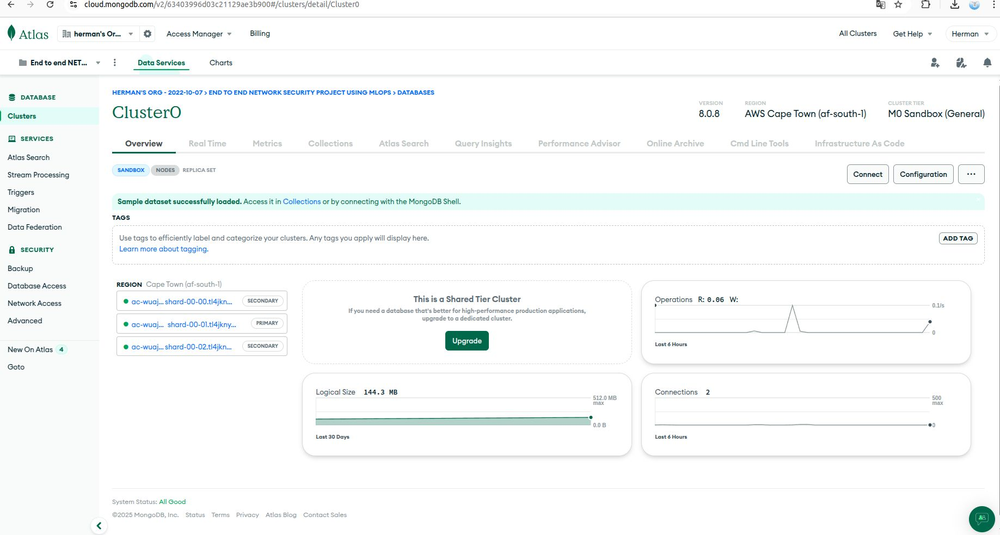
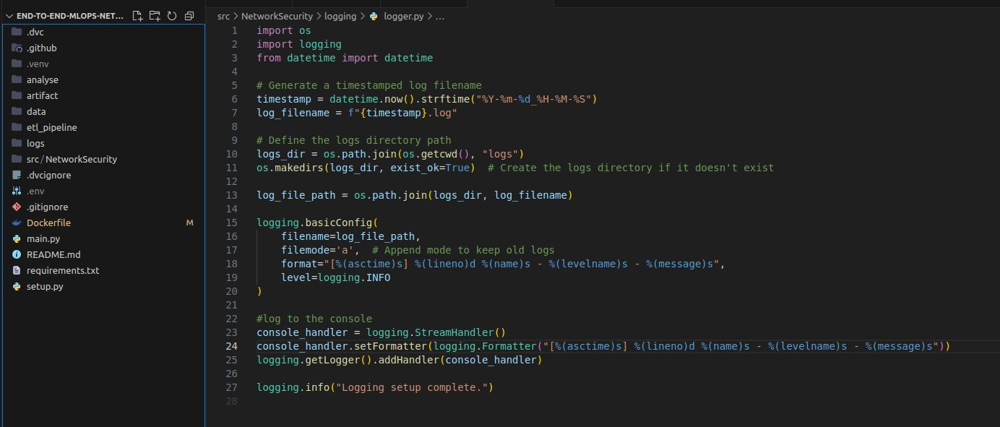
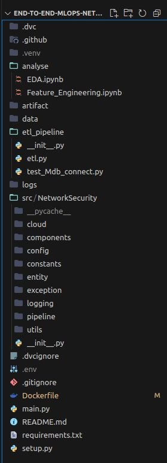

# Real-Time Phishing URL Detection – MLOps Pipeline

This project is part of my **#30DaysOfMLOpsCode** journey and aims to build a fully automated, production-ready machine learning pipeline for real-time phishing URL detection — one of the most critical tasks in modern cybersecurity.

## 🔍 Project Context

Phishing attacks are rapidly evolving and are increasingly difficult to detect, even by cybersecurity professionals. According to Intel, **97%** of users struggle to distinguish real emails from phishing attempts.

This project tackles that challenge by developing a real-time ML-powered phishing detection system, built with MLOps best practices to ensure automation, reproducibility, and scalability.

---

## 🎯 Problem Statement

**Goal:** Detect phishing URLs in real-time using machine learning, with high accuracy, while maintaining a robust and traceable pipeline through version control and automation.

---

## ✅ What Has Been Implemented So Far

### 1. Project Structure Setup

- Modular architecture with clear separation:
  - `src/` – source code for training, evaluation, and prediction
  - `config/` – configuration files for models and paths
  - `data/` – raw and processed data
  - `artifacts/` – stored outputs from pipeline stages
  - `analyze/` – notebooks for EDA and experimentation

### 2. DVC Integration

- Initialized [DVC](https://dvc.org/) to version control:
  - Raw and processed datasets
  - Intermediate artifacts
  - Pipeline stages (training, evaluation, prediction)

### 3. Logging System

- Centralized logging using Python’s `logging` module
- Consistent logging format across all modules (ETL, training, serving)

### 4. MongoDB Initialization

- Set up a MongoDB database to support the ETL and metadata tracking phase
- Intended for storing raw URL data and preprocessing logs

---

## 📊 Dataset

- **Size:** 11,430 labeled URLs
- **Features:** 87 total, covering:
  - URL structure
  - HTML content
  - Third-party reputation scores
- **Balanced:** 50% phishing, 50% legitimate

---

## 🛠️ Key Technologies & Tools

| Area              | Tools                          |
|-------------------|---------------------------------|
| Data Versioning   | DVC                             |
| Experiment Tracking | MLflow (planned)              |
| Logging           | Python `logging` module         |
| Database          | MongoDB                         |
| Language          | Python                          |
| MLOps Practice    | Modular design, version control, automation |

---

## 📚 Resources

- [Full project descriptoin link](https://docs.google.com/document/d/1tjPloGr5Cb02iBOP23sYxZSfHiuS0HaBnB0xQBEUut8/edit?tab=t.0#heading=h.hl9pf4kiorgq)

---

