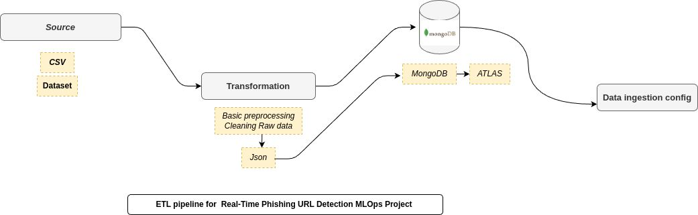
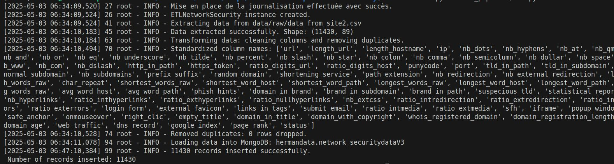
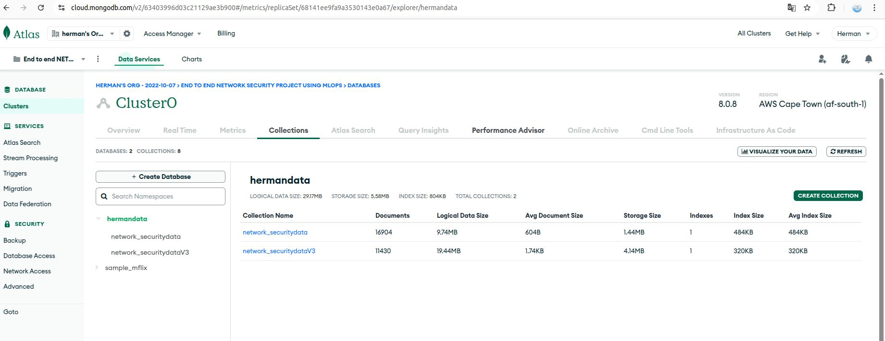
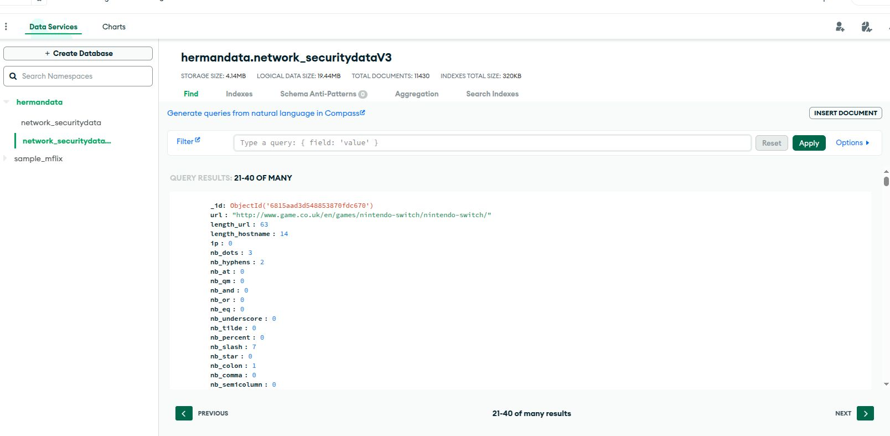

# Real-Time Phishing URL Detection – ETL Pipeline with Custom Exception Handling

This module is part of the **Real-Time Phishing URL Detection MLOps Project** documented in [Day 21](https://lnkd.in/eJNmu5dz) of my **#30DaysOfMLOpsCode**. It focuses on building a **robust ETL system** and implementing **custom exception handling** to improve maintainability and traceability of the backend.

---

## 🎯 Goal

Create a reliable, production-grade ETL pipeline that:
- Extracts raw phishing data from CSV files
- Cleans and transforms the data
- Loads structured records into a MongoDB database
- Handles errors gracefully using a custom exception framework

---

## 📦 Module Overview

### 1. ETL Pipeline

**Steps:**
- **Extract**: Load multiple CSV files containing phishing URL datasets.
- **Transform**:
  - Normalize column names
  - Remove duplicates and invalid records
  - Standardize data structure
- **Load**: Insert cleaned records into a MongoDB collection.

### 2. Custom Exception Handling

