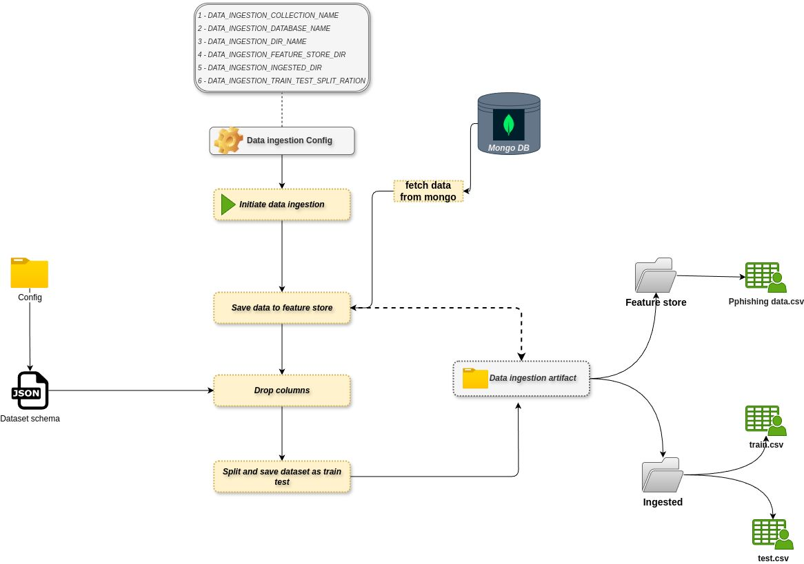
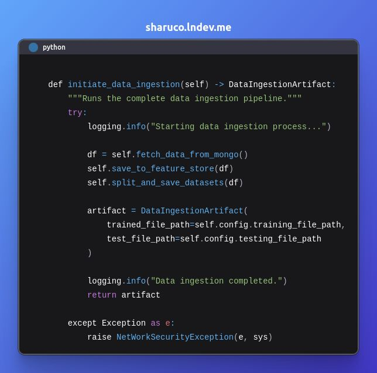
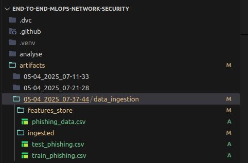
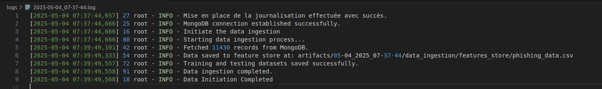

# Real-Time Phishing URL Detection – Data Ingestion Pipeline

This module implements a **robust, production-grade data ingestion pipeline** for my real-time phishing URL detection project, following [Day 22](https://lnkd.in/eJNmu5dz) of my #30DaysOfMLOpsCode.

https://www.linkedin.com/posts/herman-tcheneghon-motcheyo-8b95a7180_30daysofmlopscode-mlops-dataengineering-activity-7324722540344393728-jL52?utm_source=share&utm_medium=member_desktop&rcm=ACoAACrNWk0BT9T4VwM8q0w_jQdvWAle2tcG53A
---

## 🚀 Objective

Build a reusable and traceable ingestion pipeline that:
- Extracts data securely from MongoDB
- Cleans and converts it into structured pandas DataFrames
- Stores clean data in a central feature store
- Prepares train/test sets
- Tracks every ingestion step via versioned artifacts

---

## 🧱 Key Components

### 1. MongoDB Extraction

- Secure connection using environment variables (`MONGO_URI`, `DB_NAME`, `COLLECTION_NAME`)
- Fetches full dataset from specified collection
- Converts records into a `pandas.DataFrame`
- Cleans data: replaces `"na"` strings, removes irrelevant columns

### 2. Feature Store Storage + Split

- Saves the full clean dataset in a centralized `feature_store/` directory
- Performs a configurable **train/test split**
- Stores the outputs in the `ingested_data/` folder

### 3. Data Artifact Management

- Each run generates an artifact YAML or JSON file that:
  - Logs file paths of raw, train, and test data
  - Ensures reproducibility across training cycles
  - Can be used by downstream ML components

---

