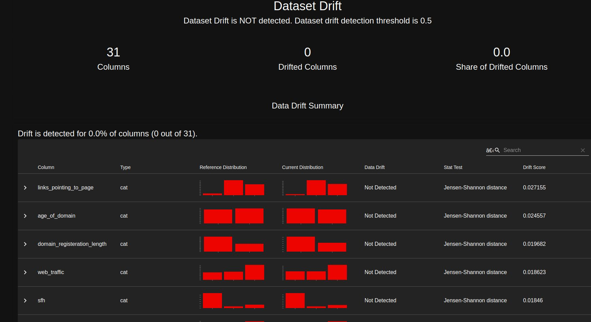
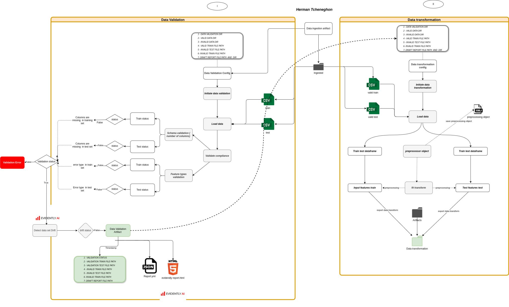
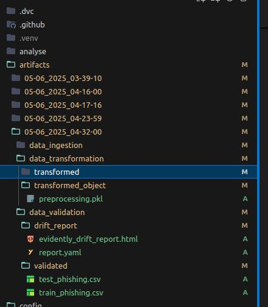
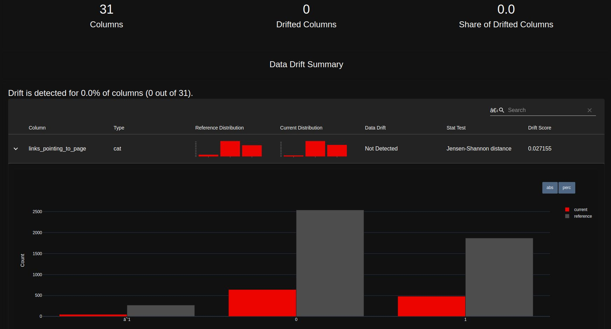
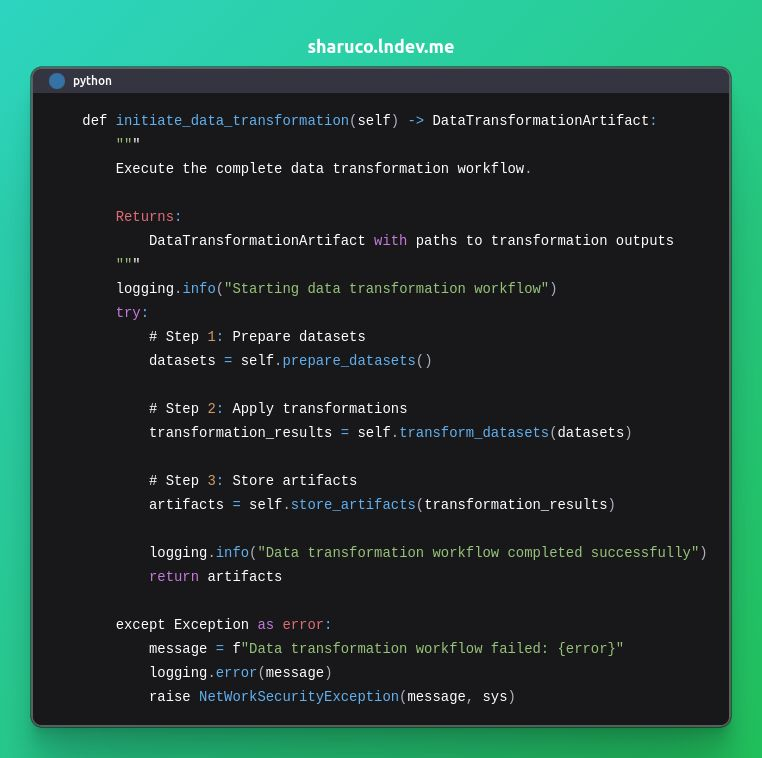
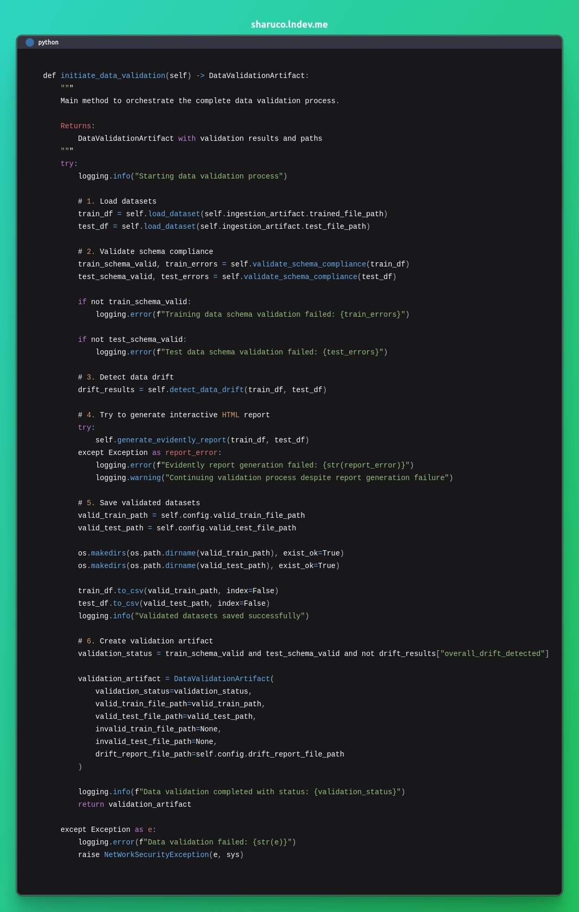
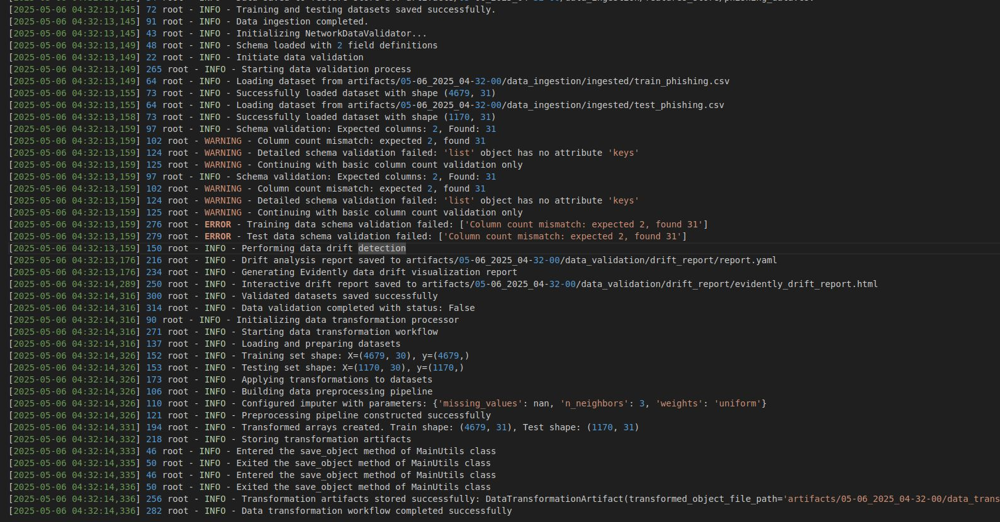

# Data validation and Transformation

https://www.linkedin.com/posts/herman-tcheneghon-motcheyo-8b95a7180_30daysofmlopscode-mlops-dataengineering-activity-7325413204694638592-yyT7?utm_source=share&utm_medium=member_desktop&rcm=ACoAACrNWk0BT9T4VwM8q0w_jQdvWAle2tcG53A

 1 - Data Validation
 I implemented a robust data validation pipeline that ensures both training and test datasets comply with the expected schema. The pipeline automatically checks for:
a) Schema compliance (column names, data types)
b) Missing or unexpected values
c) Data drift detection between training and test sets using statistical metrics
d) Visual drift reports with Evidently AI  (automated HTML generation included)
Even when the report generation fails (e.g., due to version changes), the validation continues gracefully — a key aspect of resilient MLOps workflows.

2 - Data Transformation
 Following validation, I built a transformation pipeline that prepares the data for model training. This step includes:
a) Cleaning and formatting datasets
b) Feature engineering for URL components
c) Label encoding and vectorization where needed
d) Artifact tracking for reproducibility

All artifacts (validated datasets, transformation outputs, reports) are versioned and stored, ready for the next stage in the pipeline: model training and evaluation!

Next step --> Model training

