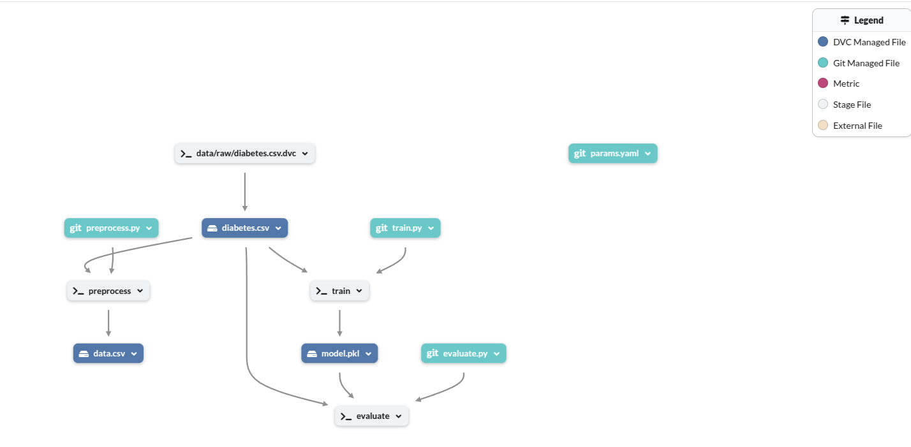

# 🩺 Diabetes Prediction Pipeline with DVC & MLflow

This project demonstrates how to build an end-to-end machine learning pipeline using **DVC** (Data Version Control) for data and model versioning, and **MLflow** for experiment tracking. The pipeline focuses on training a **Random Forest Classifier** on the **Pima Indians Diabetes Dataset**, with clearly defined stages for preprocessing, training, and evaluation.

---
## LINK OF PROJECT
- DAGSHUB : https://dagshub.com/Herman-Motcheyo/End-o-end-ML-project-with-DVC-Dagshub-Mlflow
- GITHUB : https://github.com/Herman-Motcheyo/ML-pipeline-with-DVC-Dagshub-Mlflow




## 📚 Table of Contents

- [Project Overview](#project-overview)
- [Key Features](#key-features)
- [Pipeline Stages](#pipeline-stages)
- [Goals](#goals)
- [Use Cases](#use-cases)
- [Technology Stack](#technology-stack)
- [How to Run](#how-to-run)
- [Project Structure](#project-structure)
- [Results and Logs](#results-and-logs)
- [Credits](#credits)

---

## 📘 Project Overview

This project is built to showcase how modern ML tools like **DVC** and **MLflow** can be integrated into a pipeline to make machine learning projects more reproducible, collaborative, and production-ready.

It uses the **Pima Indians Diabetes dataset** to train a Random Forest model, and integrates with **Dagshub** to host version-controlled data, model artifacts, and experiment tracking dashboards.

---

## 🔑 Key Features

### 🔹 Data Version Control (DVC)
- Track datasets, models, and scripts.
- Define a modular pipeline with reproducible stages (`preprocess`, `train`, `evaluate`).
- Manage data remotely using DagsHub or other cloud storage providers.

### 🔹 Experiment Tracking with MLflow
- Log model parameters and evaluation metrics (e.g., accuracy, precision, recall).
- Save trained models as artifacts.
- Compare and visualize experiments on the MLflow UI hosted via Dagshub.

---

## 🧱 Pipeline Stages

### 🧪 1. Preprocessing
- **Script**: `preprocess.py`
- **Input**: `data/raw/data.csv`
- **Output**: `data/processed/data.csv`
- Performs basic transformations (e.g., column cleaning, formatting).

### 🧠 2. Training
- **Script**: `train.py`
- **Model**: Random Forest Classifier
- **Output**: `models/random_forest.pkl`
- Hyperparameters are logged in `params.yaml` and tracked by MLflow.

### 📊 3. Evaluation
- **Script**: `evaluate.py`
- Loads the trained model and evaluates its performance.
- Logs accuracy and classification report to MLflow.

---

## 🎯 Goals

- ✅ **Reproducibility**: Ensure that every result can be regenerated with the same data and parameters.
- ✅ **Experimentation**: Enable rapid testing of different hyperparameter configurations.
- ✅ **Collaboration**: Allow teams to work in sync with versioned data, models, and code.

---

## 🧠 Use Cases

- **Data Science Teams**: Manage and share datasets, models, and results efficiently.
- **Machine Learning Research**: Facilitate reproducible experiments and benchmarking.
- **MLOps**: Set a solid foundation for deploying pipelines into production environments.

---

## 🛠️ Technology Stack

| Tool / Library   | Role                                      |
|------------------|-------------------------------------------|
| Python           | Core scripting and development            |
| DVC              | Data/model versioning & pipeline orchestration |
| MLflow           | Experiment tracking and model registry    |
| Scikit-learn     | Random Forest model implementation        |
| Dagshub          | Remote DVC and MLflow tracking dashboard  |
| Git + GitHub     | Version control and collaboration         |

---

## 🚀 How to Run

1. **Clone the repository:**
   ```bash
   git clone <your-repo-url>
   cd diabetes-pipeline
